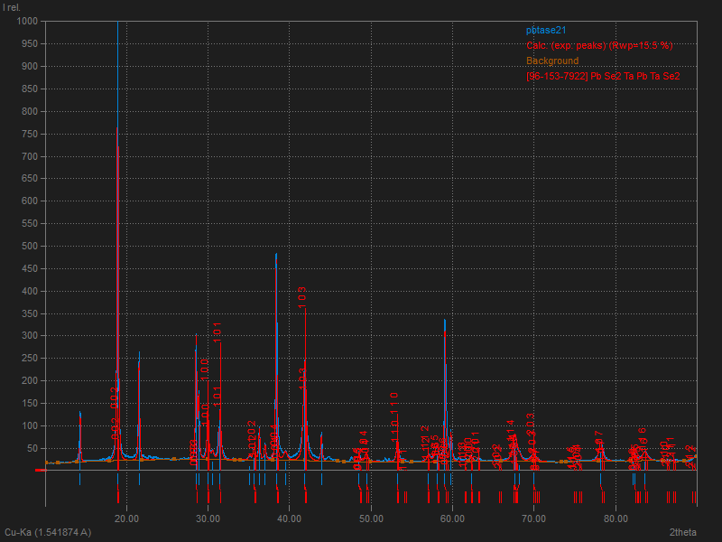
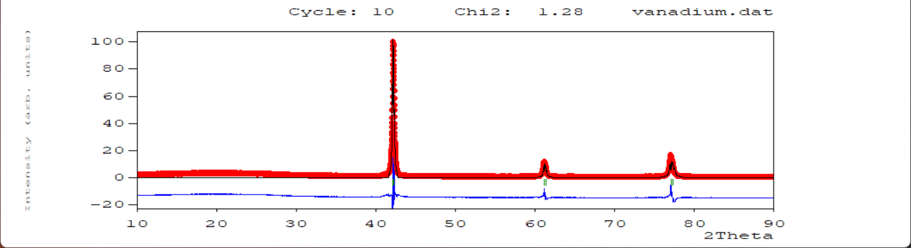
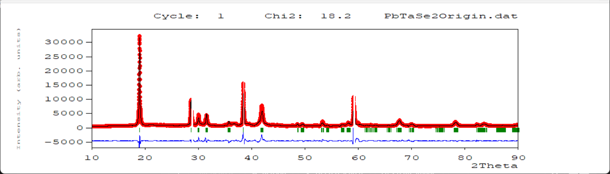
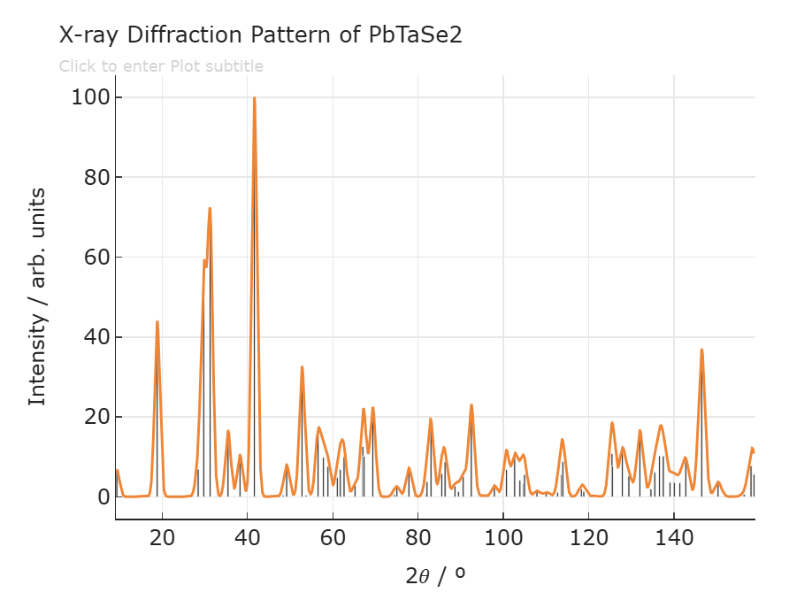
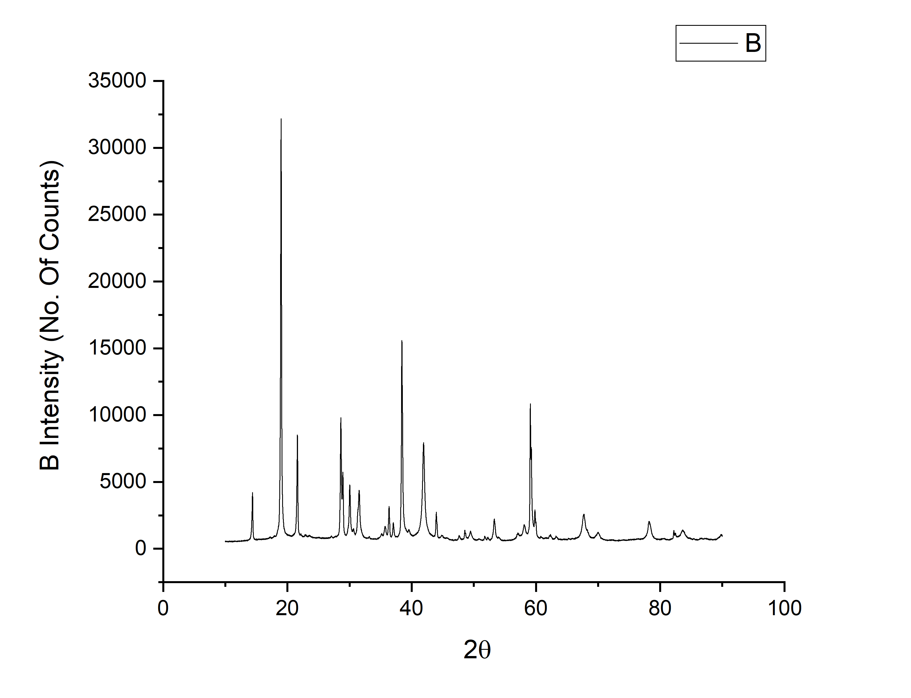

# Study-of-Growth-Techniques-and-Structural-Analysis-of-2D-van-der-Waals-Material

## 📘 Overview

This project focuses on the structural analysis of **2D van der Waals (vdW) materials**, particularly **PbTaSe₂**, using experimental XRD data. The project emphasizes the refinement process and crystallographic characterization in the absence of synthesis infrastructure, applying advanced tools like FullProf and Match! for data analysis.

---

## 🧪 Objectives

- Analyze PbTaSe₂ crystal structure using powder XRD data.
- Perform phase identification via **Match!** software.
- Refine diffraction data using **FullProf**, addressing challenges like texture and impurity peaks.
- Compare experimental parameters with reference datasets from the **Materials Project**.

---

## 🔧 Tools and Technologies

- 🔍 **Match!** for phase identification  
- 🧬 **FullProf Suite** for Rietveld refinement  
- 📊 **Origin** for data preprocessing and filtering  
- 🧾 **Crystallographic Databases**: COD, Materials Project  
- 🖋️ **LaTeX** for report documentation  

---

## 🧱 Methodology

### 📌 Sample Preparation & XRD Scanning
- Vanadium used as a standard sample; PbTaSe₂ as the primary target.
- Powdered samples scanned using a Cu X-ray source (40 kV, 30 mA).
- Scan Range: 10°–90°  | Step Size: 0.01°  | Format: `.xy`

### 🔎 Phase Identification
- Match! software matched PbTaSe₂ to space group **P$\bar{3}$m1** from the Materials Project.

---

## ⚙️ Refinement Using FullProf

- Applied Rietveld refinement on both Vanadium and PbTaSe₂.
- Corrected for texture using **March–Dollase** model.
- Removed oil contamination peaks with **Origin**.
- Excluded ghost peaks from Kβ radiation using **Bragg’s Law validation**.

**Vanadium (Standard Sample):**

**PbTaSe₂ Final Refinement:**

---

## 📐 Texture Representation and Comparison

Texture (preferred orientation) was observed along the \( l \)-direction in PbTaSe₂, leading to intensity distortions. Below is a comparison of the database vs experimental data to show the impact:

<table>
<tr>
<td align="center"><strong>Database Reference</strong></td>
<td align="center"><strong>Experimental Data</strong></td>
</tr>
<tr>
<td></td>
<td></td>
</tr>
</table>

---

## 📊 Results Summary

| Parameter               | Experimental     | Materials Project |
|------------------------|------------------|-------------------|
| Crystal System         | Trigonal         | Trigonal          |
| Space Group            | P$\bar{3}$m1     | P$\bar{3}$m1      |
| Lattice Parameter \(a\)| 3.44 Å           | 3.435 Å           |
| Lattice Parameter \(c\)| 9.38 Å           | 9.365 Å           |
| Refined χ² Value       | 18.3             | N/A               |

---

## 🧠 Key Learnings

- Developed end-to-end crystallographic analysis skills from XRD data to final refinement.
- Understood and corrected practical issues: texture, impurity, and Kβ radiation effects.
- Validated experimental lattice parameters against reference datasets successfully.

---

## 📌 Conclusion

This project demonstrates how open-source tools can be leveraged for high-accuracy structural analysis of complex 2D materials. Despite limited synthesis infrastructure, key crystallographic properties of PbTaSe₂ were successfully identified, refined, and validated against standard databases.

---

> **Supervisor**: Dr. Ritu Gupta  
> **Course Code**: CP301  
> **Author**: Bhargav Naidu Palavalasa  
> [🔗 GitHub Repository](https://github.com/Bhargav-Naidu-29/Growth-Techniques-and-Structural-Analysis-of-2D-van-der-Waals-Materials)

